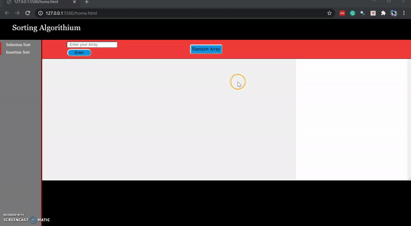

# VISUALIZATION ALGORITHM

 

 

> ***Underdevelopment Project***

### **Description** 

This is my first project with JS.

 

> **AIM** : **To Show Algorithum in action**.

 

### **Features**

* Realtime Pass's
* Time Complexity
* We Can get random array of numbers to graph
* We could also add User defined array

