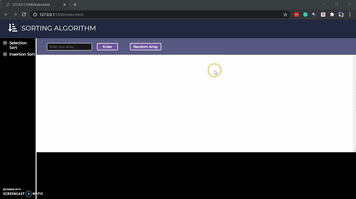

# VISUALIZATION ALGORITHM

 

 

This is my first project with JS.

 

> **AIM** : *To Show Algorithum in action*.

### **Features**

* Realtime Pass's
* Time Complexity
* Can get random graph
* We could also add User defined array

